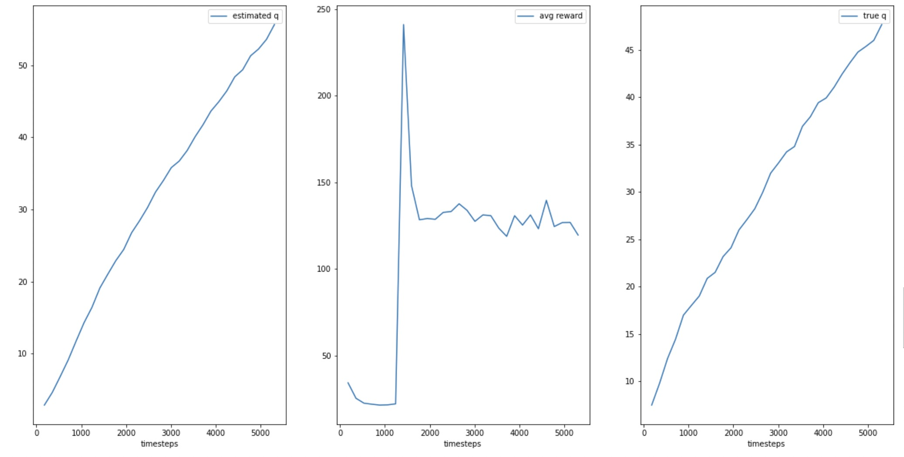
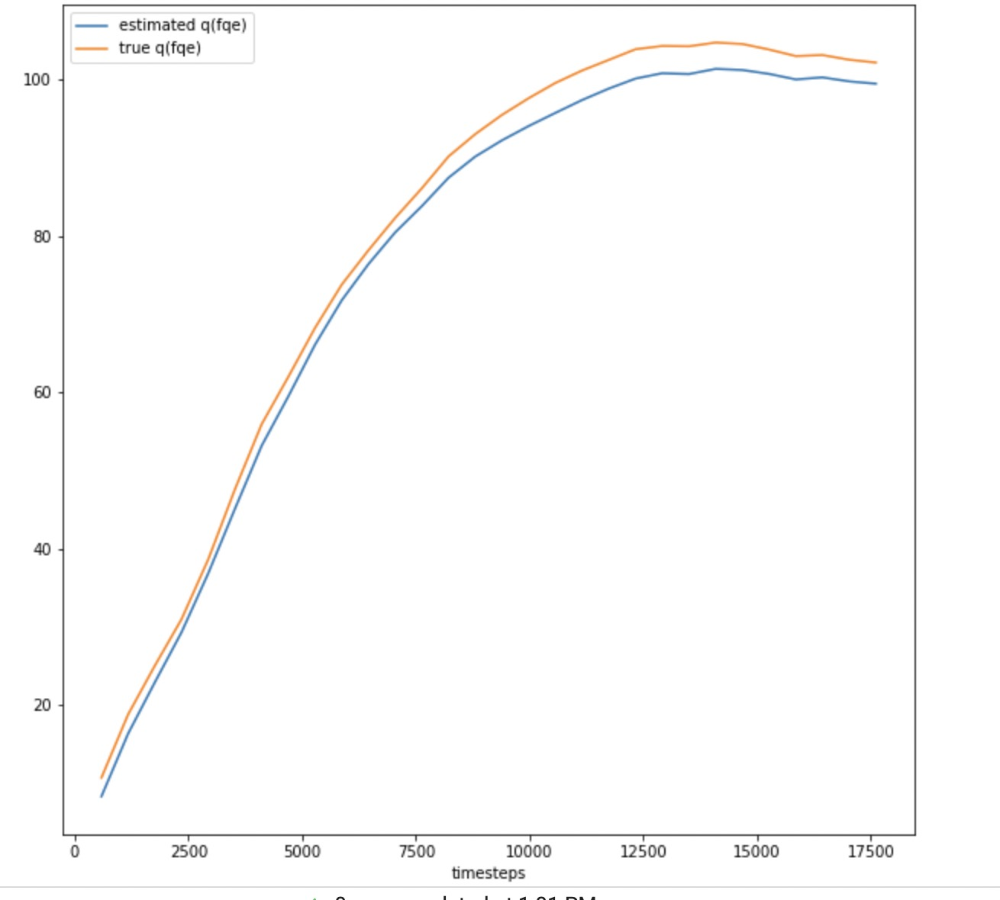

# AIPI 530: Deep Reinforcement Learning 
This repository provides access to an offline reinforcement learning implementation.

If you'd like to learn more about RL and Offline RL, please checkout my blog post on the topic.

The code used to start the project has been forked from [d3rlpy](https://github.com/takuseno/d3rlpy), you can find more details on the citation at the bottom.
 
--- 

## Installation

1. First, you'll need to clone this repository: `https://github.com/SarnadAbhilash/offlineRL.git`
2. Then, you need to install **pybullet** from the source, you can do that by doing:
 `pip install git+https://github.com/takuseno/d4rl-pybullet`
3. Installation of dependencies:
 `pip install Cython numpy` 
 `pip install -e .`

## Getting Started 

After the installation process you can execute the file **`cql_train.py`**

   * Using the default number of epochs (1) `python cql_train.py` 
   * Alternatively, directly specify the number of epochs `python cql_train.py --epochs_cql 30 --epochs_fqe 30`


Here's an example of how to run this using Google [Colab](https://colab.research.google.com/drive/1dWiLXPUX1YHtLY5rIRBKJR3RZneCrjJm?usp=sharing).

### Example using 30 epochs:



## More Examples

For more examples, of offline reinforcement learning implementations see d3rlpy's github [repository](https://github.com/takuseno/d3rlpy).

## examples
### MuJoCo
<p align="center"></p>

```py
import d3rlpy

# prepare dataset
dataset, env = d3rlpy.datasets.get_d4rl('hopper-medium-v0')

# prepare algorithm
cql = d3rlpy.algos.CQL(use_gpu=True)

# train
cql.fit(dataset,
        eval_episodes=dataset,
        n_epochs=100,
        scorers={
            'environment': d3rlpy.metrics.evaluate_on_environment(env),
            'td_error': d3rlpy.metrics.td_error_scorer
        })
```

See more datasets at [d4rl](https://github.com/rail-berkeley/d4rl).

### Atari 2600
<p align="center"></p>

```py
import d3rlpy
from sklearn.model_selection import train_test_split

# prepare dataset
dataset, env = d3rlpy.datasets.get_atari('breakout-expert-v0')

# split dataset
train_episodes, test_episodes = train_test_split(dataset, test_size=0.1)

# prepare algorithm
cql = d3rlpy.algos.DiscreteCQL(n_frames=4, q_func_factory='qr', scaler='pixel', use_gpu=True)

# start training
cql.fit(train_episodes,
        eval_episodes=test_episodes,
        n_epochs=100,
        scorers={
            'environment': d3rlpy.metrics.evaluate_on_environment(env),
            'td_error': d3rlpy.metrics.td_error_scorer
        })
```

See more Atari datasets at [d4rl-atari](https://github.com/takuseno/d4rl-atari).

### PyBullet
<p align="center"></p>

```py
import d3rlpy

# prepare dataset
dataset, env = d3rlpy.datasets.get_pybullet('hopper-bullet-mixed-v0')

# prepare algorithm
cql = d3rlpy.algos.CQL(use_gpu=True)

# start training
cql.fit(dataset,
        eval_episodes=dataset,
        n_epochs=100,
        scorers={
            'environment': d3rlpy.metrics.evaluate_on_environment(env),
            'td_error': d3rlpy.metrics.td_error_scorer
        })
```

See more PyBullet datasets at [d4rl-pybullet](https://github.com/takuseno/d4rl-pybullet).

## Try some Tutorials
Try a cartpole example on Google Colaboratory!

- offline RL tutorial: [](https://colab.research.google.com/github/takuseno/d3rlpy/blob/master/tutorials/cartpole.ipynb)
- online RL tutorial: [](https://colab.research.google.com/github/takuseno/d3rlpy/blob/master/tutorials/online.ipynb)

## Citation

```
{authors:
- family-names: "Seno"
  given-names: "Takuma"
title: "d3rlpy: An offline deep reinforcement learning library"
version: 0.91
date-released: 2020-08-01
url: "https://github.com/takuseno/d3rlpy"
preferred-citation:
  type: conference-paper
  authors:
  - family-names: "Seno"
    given-names: "Takuma"
  - family-names: "Imai"
    given-names: "Michita"
  journal: "NeurIPS 2021 Offline Reinforcement Learning Workshop"
  conference:
    name: "NeurIPS 2021 Offline Reinforcement Learning Workshop"
  collection-title: "35th Conference on Neural Information Processing Systems, Offline Reinforcement Learning Workshop, 2021"
  month: 12
  title: "d3rlpy: An Offline Deep Reinforcement Learning Library"
  year: 2021
}
> https://github.com/takuseno/d3rlpy.git 
```